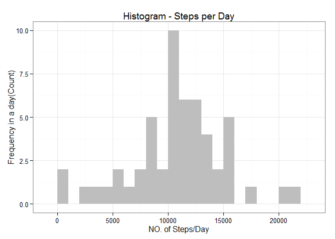
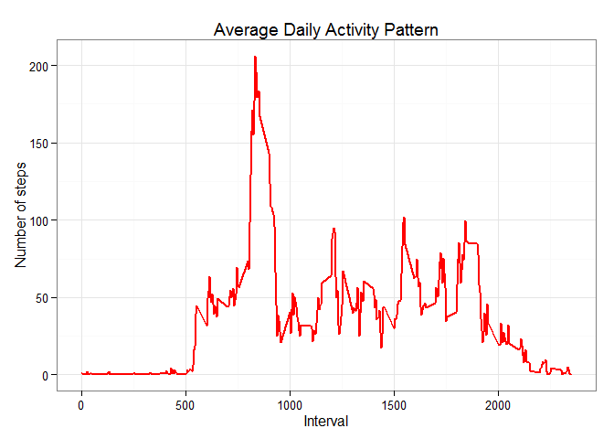
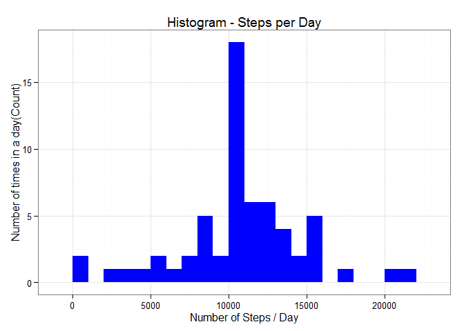
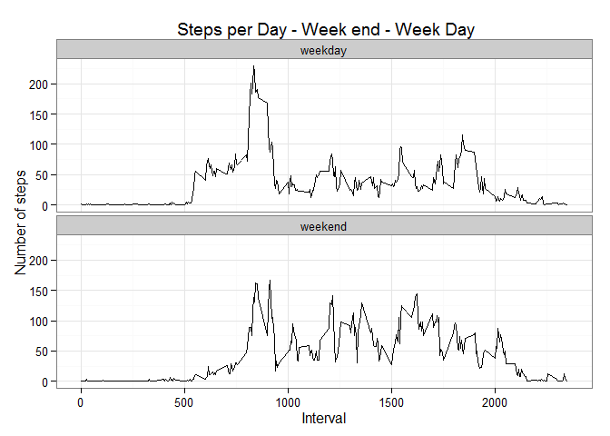

# Reproducible Research: Peer assessment 1

###### Github repository with RMarkdown source code: https://github.com/aruneral01/RepData_PeerAssessment1\
[linked phrase](https://github.com/aruneral01/RepData_PeerAssessment1\)

====================================================

## Introduction

This document presents the results of Assignment 1 of course [Reproducible Research](https://class.coursera.org/repdata-004) on [coursera](https://www.coursera.org). 

Through this report you can see that activities on weekdays mostly follow a work related routine, where we find some more intensity activity in little a free time that the employ can made some sport. 


### Load required libraries


```r
library(data.table)
library(ggplot2) # we shall use ggplot2 for plotting figures
library(knitr)
```


## Loading and preprocessing the data

This assignment makes use of data from a personal activity monitoring device. This device collects data at 5 minute intervals through out the day. The data consists of two months of data from an anonymous individual collected during the months of October and November, 2012 and include the number of steps taken in 5 minute intervals each day.  


```r
assign1data <- read.csv('activity.csv', header = TRUE, sep = ",",
                  colClasses = c("numeric", "character", "numeric"))
```

### Tidy the data or preprocess the data

We convert the **date** field to `Date` class and **interval** field to `Factor` class.


```r
assign1data$date <- as.Date(assign1data$date, format = "%Y-%m-%d")
assign1data$interval <- as.factor(assign1data$interval)
```

Now, let us check the data using `str()` method:


```r
str(assign1data)
```

```
## 'data.frame':	17568 obs. of  3 variables:
##  $ steps   : num  NA NA NA NA NA NA NA NA NA NA ...
##  $ date    : Date, format: "2012-10-01" "2012-10-01" ...
##  $ interval: Factor w/ 288 levels "0","5","10","15",..: 1 2 3 4 5 6 7 8 9 10 ...
```

## What is mean total number of steps taken per day?

Now here we ignore the missing values(*a valid assumption*).

We proceed by calculating the total steps per day.


```r
steps_day <- aggregate( steps ~ date, assign1data, sum)
colnames(steps_day) <- c("date","steps")
head(steps_day)
```

```
##         date steps
## 1 2012-10-02   126
## 2 2012-10-03 11352
## 3 2012-10-04 12116
## 4 2012-10-05 13294
## 5 2012-10-06 15420
## 6 2012-10-07 11015
```

A. Histogram of the total number of steps taken per day, plotted with appropriate bin interval.


```r
ggplot(steps_day, aes(x = steps)) + 
       geom_histogram(fill = "grey", binwidth = 1000) + 
        labs(title = "Histogram - Steps per Day", 
             x = "NO. of Steps/Day", y = "Frequency in a day(Count)") + theme_bw() 
```

 

B. Now we calculate the ***mean*** and ***median*** of the number of steps taken per day.


```r
steps_mean   <- mean(steps_day$steps, na.rm = TRUE)
steps_median <- median(steps_day$steps, na.rm = TRUE)
```

The mean is **10766.189** and median is **10765**.

## What is the average daily activity pattern?

Calculate the aggregation of steps - 5-minute intervals and convert the intervals as integers and save them in a data frame called `steps_interval`.


```r
steps_interval <- aggregate(assign1data$steps, 
                                by = list(interval = assign1data$interval),
                                FUN = mean, na.rm = TRUE)

steps_interval$interval <- 
        as.integer(levels(steps_interval$interval)[steps_interval$interval])

colnames(steps_interval) <- c("interval", "steps")
```


A. Plot with time series the average # of steps taken (averaged across all days) vs. 5-minute intervals:


```r
ggplot(steps_interval, aes(x = interval, y= steps)) +   
        geom_line(color = "red", size= 1) +  
        labs(title= "Average Daily Activity Pattern", x= "Interval", y= "Number of steps") +  
        theme_bw()
```

 


B. 5-minute interval with the containing the maximum number of steps:


```r
max_interval <- steps_interval[which.max(  
        steps_interval$steps),]
```

The **835<sup>th</sup>** interval has maximum **206** steps.


## Inputting missing values:

### A. Total number of missing values:

The total number of missing values in steps can be calculated using `is.na()` method to check whether the value is mising or not and then summing the logical vector.


```r
m_vals <- sum(is.na(assign1data$steps))
```

The total number of ***missing values*** are **2304**.

### B. Strategy for filling in all of the missing values in the dataset

To populate missing values, we choose to replace them with the mean value at the same interval across days. 

We create a function `na_fill(data, pervalue)` which the `data` arguement is the `assign1data` data frame and `pervalue` arguement is the `steps_interval` data frame.


```r
na_fill <- function(data, pervalue) {
        na_index <- which(is.na(data$steps))
        na_replace <- unlist(lapply(na_index, FUN = function(idx){
                interval = data[idx,]$interval
                pervalue[pervalue$interval == interval,]$steps
        }))
        fill_steps <- data$steps
        fill_steps[na_index] <- na_replace
        fill_steps
}

assign1data_fill <- data.frame(  
        steps = na_fill(assign1data, steps_interval),  
        date = assign1data$date,  
        interval = assign1data$interval)
str(assign1data_fill)
```

```
## 'data.frame':	17568 obs. of  3 variables:
##  $ steps   : num  1.717 0.3396 0.1321 0.1509 0.0755 ...
##  $ date    : Date, format: "2012-10-01" "2012-10-01" ...
##  $ interval: Factor w/ 288 levels "0","5","10","15",..: 1 2 3 4 5 6 7 8 9 10 ...
```

Look for any missing values remaining or not


```r
sum(is.na(assign1data_fill$steps))
```

```
## [1] 0
```

Looks like none

### C. Histogram - total number of steps taken every day

Now let us plot a histogram plotted with a bin interval of 1000 steps, after filling missing values.


```r
fill_steps_day <- aggregate ( steps ~ date, assign1data_fill, sum)
colnames(fill_steps_day) <- c("date","steps")

##plot the histogram

ggplot(fill_steps_day, aes(x = steps)) + 
       geom_histogram(fill = "blue", binwidth = 1000) + 
        labs(title = "Histogram - Steps per Day", 
             x = "Number of Steps / Day", y = "Number of times in a day(Count)") + theme_bw() 
```

 

### Report the **mean** and **median** total number of steps taken per day.


```r
steps_mean_fill   <- mean(fill_steps_day$steps, na.rm = TRUE)
steps_median_fill <- median(fill_steps_day$steps, na.rm = TRUE)
```

The mean is **10766.189** and median is **10766.189**.

### Do these values differ from the estimates from the first part of the assignment?

Yes, these values do differ slightly.

- **Before filling the data**
    1. Mean  : **10766.189**
    2. Median: **10765**
    
    
- **After filling the data**
    1. Mean  : **10766.189**
    2. Median: **10766.189**

We see that the values after filling the data mean and median are equal.

### What is the impact of imputing missing data on the estimates of the total daily number of steps?

As you can see, comparing with the calculations done in the first section of this document, we observe that while the mean value remains unchanged, the median value has shifted and virtual matches to the mean.  

Since our data has shown a t-student distribution (see both histograms), it seems that the impact of imputing missing values has increase our peak, but it's not affect negatively our predictions. 


## Are there differences in activity patterns between weekdays and weekends?


```r
weekdays_steps <- function(data) {
    weekdays_steps <- aggregate(data$steps, by= list(interval = data$interval),
                          FUN= mean, na.rm = T)
    # convert to integers for plotting
    weekdays_steps$interval <- 
            as.integer(levels(weekdays_steps$interval)[weekdays_steps$interval])
    colnames(weekdays_steps) <- c("interval", "steps")
    weekdays_steps
}

data_by_weekdays <- function(data) {
    data$weekday <- 
            as.factor(weekdays(data$date)) # weekdays
    weekend_data <- subset(data, weekday %in% c("Saturday","Sunday"))
    weekday_data <- subset(data, !weekday %in% c("Saturday","Sunday"))
    
    weekend_steps <- weekdays_steps(weekend_data)
    weekday_steps <- weekdays_steps(weekday_data)
    
    weekend_steps$dayofweek <- rep("weekend", nrow(weekend_steps))
    weekday_steps$dayofweek <- rep("weekday", nrow(weekday_steps))
    
    data_by_weekdays <- rbind(weekend_steps, weekday_steps)
    data_by_weekdays$dayofweek <- as.factor(data_by_weekdays$dayofweek)
    data_by_weekdays
}

data_weekdays <- data_by_weekdays(assign1data_fill)
```

Below you can see the panel plot comparing the average number of steps taken per 5-minute interval across weekdays and weekends:


```r
ggplot(data_weekdays, aes(x = interval, y = steps)) + 
        geom_line(color = "black") + 
        facet_wrap(~dayofweek, nrow = 2, ncol = 1) +
        labs(title = " Steps per Day - Week end - Week Day", x = "Interval", y = "Number of steps") +
        theme_bw()
```

 

### We can see at the graph above that activity on the weekday has the greatest peak. But, we can see too that weekends activities has more peaks than weekday. This may be since activities on weekdays mostly follow routine, where we find some more intensity activity in little a free time. On the other hand, at weekend we can see better distribution of effort along the entire day.
